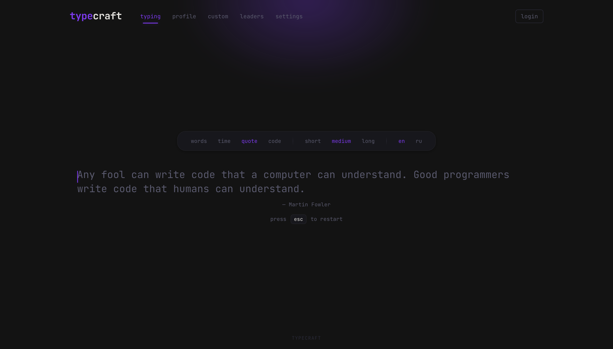
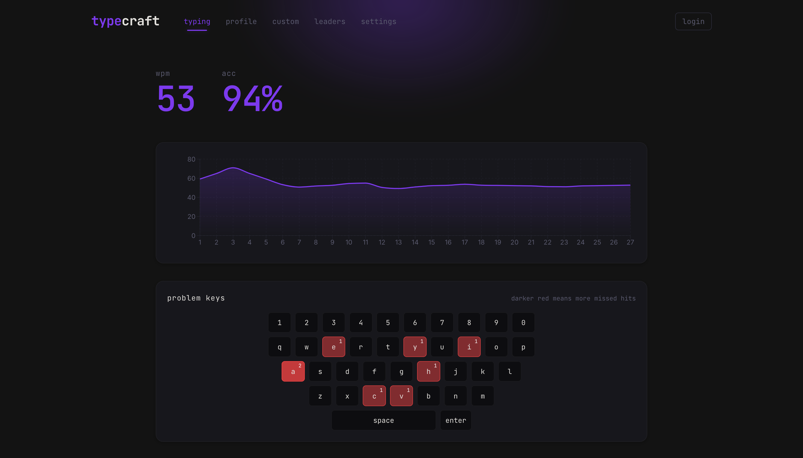

# TypeCraft

### Веб-сервис для практики быстрой печати и печати вслепую.

<p>
  
  
  
  
  
  
</p>

---

## Возможности

### Режимы печати

- `words` — набор случайных слов (10 / 25 / 50 / 100)
- `time` — печать на время (15 / 30 / 60 / 120 сек)
- `quote` — цитаты разной длины
- `code` — фрагменты реального кода (JS, TS, Python, Go, Rust, Java, C++)

### Статистика и профиль

- WPM, raw WPM, точность, консистентность
- Графики прогресса и история тестов
- Личные рекорды по каждому режиму

### Кастомизация

- Тёмная и светлая тема
- Настраиваемый шрифт и размер
- Плавная каретка, звуковые эффекты
- Русский и английский интерфейс

---

## Стек технологий

| Слой           | Технологии                                                                              |
| :------------- | :-------------------------------------------------------------------------------------- |
| Frontend       | React 19, TypeScript, Vite, CSS Modules, React Router, Zustand, Framer Motion, Recharts |
| Backend        | Node.js, Express, TypeScript, Drizzle ORM, better-sqlite3, Zod                          |
| Аутентификация | JWT (jsonwebtoken + bcryptjs)                                                           |
| Инструменты    | npm workspaces, ESLint, Prettier, Vitest, concurrently                                  |

---

## Быстрый старт

```bash
# Установка зависимостей
npm install

# Запуск frontend + backend одновременно
npm run dev
```

| Сервис      | URL                   |
| :---------- | :-------------------- |
| Frontend    | http://localhost:5173 |
| Backend API | http://localhost:3001 |

Дополнительные команды:

```bash
npm run dev:frontend   # только фронтенд
npm run dev:backend    # только бэкенд
npm run build          # продакшн-сборка
npm run lint           # линтинг
npm run format         # форматирование
npm run test           # тесты
```

---

## Структура проекта

```
typecraft/
├── frontend/   React-приложение (Vite + CSS Modules)
├── backend/    REST API (Express + Drizzle + SQLite)
├── shared/     Общие TypeScript-типы
└── package.json
```

## Скриншоты


